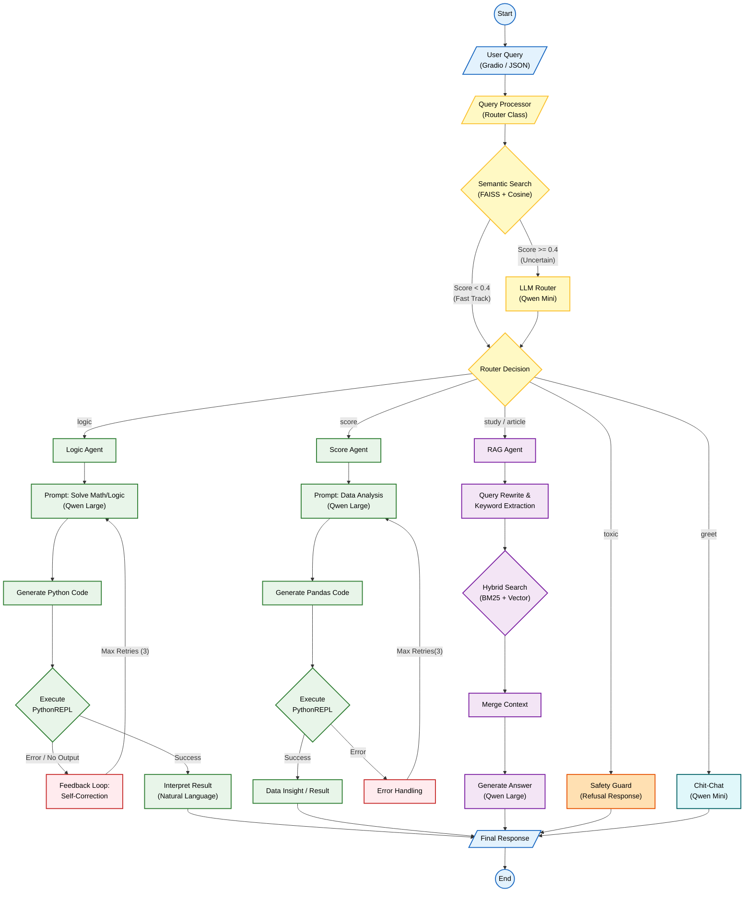

# Agentic-RAG-Project

This system uses agentic rag architecture including brilliant router to optimize accuracy and productivity for specified type of question

## 1.OverView
Project aims not only to develop a normal RAG chatbot, but also build an **Agentic workflow**. An intelligient Router determines the intention of users and dirent the queries from them to a specified expert(agent)

- Logic Agent: Mathematic, logical problems solving
- Score Agent: Do analysis on table(CSV) with pandas.
- Knowledge Agent (Study/Article): Research materials deeply using hybrid search (Semantic + Keyword).
- Router: Queries classification using Semantic Similarity and decision from small llm.
- Chit Chat: If the user greets the system, or ask unrelated question, the system will greet and introduce it.

## 2.Pipeline


## 3.Tech Stack
| Component | Implementation |
| :--- | :--- |
| **Orchestration** | **LangChain**|
| **Main LLM (Reasoning)** | **Qwen 2.5 1.5B Instruct** |
| **Router / Classifier** | **Qwen 3 4B** |
| **Vector Database** | **FAISS Engine** |
| **Retrieval Strategy** | **Hybrid (BM25 + Vector)** |
| **Code Execution** | **PythonREPL** (LangChain Experimental Sandbox) |
| **Math Solver** | **Program of Thought (PoT)** w/ Self-Correction Loop |
| **Data Processing** | Regex, JSON, Pandas (CSV handling) |
| **Environment** | Python 3.10+ |

## 4 Source Code Structure
```
agentic-rag-project/
│
├── .gitignore              
├── requirements.txt        
├── README.md               # 
├── main.py                 # (Entry point)
│
├── data/                   # Data containing
│   ├── raw/                # raw data (study.txt, article.txt, scores.csv)
│   └── vectordb/           # Save index here
│
├── src/                    # Source code 
│   ├── __init__.py         
│   │
│   ├── config.py           # Class Config 
│   │
│   ├── models/             # Load llm and embedding
│   │   ├── __init__.py
│   │   ├── llm_loader.py   # Function get_router(), get_agent()
│   │   └── embedding.py    # HelperEmbeddingsAdapter
│   │
│   ├── rag/                # RAG
│   │   ├── __init__.py
│   │   ├── loader.py       # Class Loader, TextSplitter
│   │   ├── vectordb.py     # Class VectorDB
│   │   └── utils.py        # Function handling text (bm25 utils)
│   │
│   ├── agents/             # Logic and decision
│   │   ├── __init__.py
│   │   ├── router.py       # Class Router (Logical Classification)
│   │   └── main_agent.py   # Class Main (Main Program)
│   │
│   └── interface/          # Interface 
│       ├── __init__.py
│       └── ui.py           # Gradio script (create_ui)
│
└── Project_Datacom_colab.ipynb  # I developed this system here, You can run demo here
└── Project_Datacom_local.ipynb  # I can locally run demo here 
```

## 5.Detail Feature 
### 5.1 Semantic Router
- Use **FAISS** to compare the user's question with embedded sample sentences (examples).
- Mechanism: Calculate Cosine Similarity. If distance(1-cosine similarity) < 0.4 -> Fast Track (go straight to the corresponding Agent). If unsure -> Use LLM Mini for classification.

### 5.2 Logic Agent (Math & Logic)
- **Process**: Prompt LLM writes Python code -> Extracts code -> Runs on PythonREPL -> Gets output.
- **Self-Correction**: If the code fails, the system automatically sends a traceback message back to the LLM requesting a rewrite of the code. A maximum of 3 retries are allowed.

### 5.3 Score Agent (Data Analysis)
- Designed expert to do analysis on student_scores.csv
- LLM automatically generates pandas do statistics on data and return natural results.

### 5.4 RAG Agent (Hybrid Search)
- **Semantic Search**: Search based on meaning (using the embedding model).
- **Keyword Search (BM25)**: Search based on exact keywords (important for proper names, places, numbers).
- **Weighted Fusion**: Combine the results from the two searching algorithms above according to weighting (e.g., 0.5/0.5) to produce the best context for LLM.

## 6. Implementation
### 6.1 Clone and Install Needed Frameworks
```
git clone https://github.com/Tuevu110405/Agentic-RAG-Project.git
pip install -r requirements.txt
``` 
### 6.2 Data Prepare 
Consulting data_crawling.ipynb to get enough study.txt, article.txt, student_scores.csv. Making sure that they are in data/raw
### 6.3 Configuration 
Edit src/config.py if you want to change the Model or device (CUDA/CPU) or anything else.
### 6.4 Running 
```
python main.py

```


The project is published under APACHE License 2.0

You can run demo at [Colab Notebook](https://colab.research.google.com/drive/1rvls42CmH4Ssii1IF5jrIGJ6ks63U6nv#scrollTo=4_Gg_EIiRDu9)
